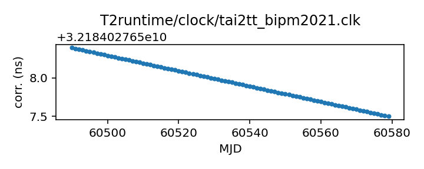

## TAI to TT(BIPM2021)

TAI to BIPM-updated TT, 2021 version

This file is constructed from BIPM published data and should
never change; updated versions will appear approximately
yearly, and do revise old data. Aa result they are given different
clock file names, and are treated as different time scales.

The time scale TT is supposed to be a basis for TDB, and is meant
to be a stable clock for describing the motions of the solar system.
Of necessity it is derived from the practical time scale TAI,
which is produced by an ensemble of atomic clocks. A simple
realization of TT, such as that implemented by Astropy,
simply yields TT = TAI + 32.184 s.

Atomic clocks do wander, and the BIPM can sometimes estimate
that wander in retrospect.  Rather than revise TAI, the BIPM
offers versions of TT that are more stable because they
compensate for variations in TAI. These are defined by yearly
bulletins, and are referred to in TEMPO2 as TT(BIPMyyyy), where
yyyy is the year of the bulletin.

Each bulletin publishes corrections from TAI to TT. It may
revise earlier corrections up to about 10 years back, and it
contains a formula for making predictions past the end of the
data it contains.

This clock file is automatically generated from the bulletin
for 2021. It contains forecasted values for 1000 days past the
end of the tabulated data. This is marked by a comment in the
clock file itself.

If you have questions about this, contact Anne Archibald
<anne.archibald@newcastle.ac.uk>. For more detailed questions
about the BIPM's published corrections, contact <tai@bipm.org>.

|     |     |
|:--- |:--- |
| File | `T2runtime/clock/tai2tt_bipm2021.clk` |
| Authority | observatory |
| URL in repository | <https://raw.githubusercontent.com/ipta/pulsar-clock-corrections/main/T2runtime/clock/tai2tt_bipm2021.clk> |
| Original download URL | <None> |
| Format | tempo2 |
| Bogus last correction | False |
| Clock file start | 1975-06-26 MJD 42589.0 |
| Clock file end | 2024-09-26 MJD 60579.0 |
| Update interval (days) | inf |
| Last update attempt | 2022-06-13 |
| Last update result | Updated |

Log entries from the last few update attempts:
```
2022-06-13 13:43:53.362 - No way to download: 'T2runtime/clock/tai2tt_bipm2021.clk'
2022-06-13 13:43:53.372 - Updated
```
[Full log](https://raw.githubusercontent.com/ipta/pulsar-clock-corrections/main/log/T2runtime/clock/tai2tt_bipm2021.clk.log)

Leading comments from clock file:

    # TT(BIPM) is a realization of Terrestrial Time as defined by
    # Recommendation IV of Resolution A4 of the International Astronomical
    # Union, adopted at its XXIst General Assembly (1991), and updated by
    # Resolution B1.9 at its XXIVth General Assembly (2000).
    # From Recommendation III of IAU Resolution A4 (1991), the origin of TT(BIPM)
    # is defined by the following relation to TAI :
    #
    # TT(BIPM) = TAI + 32.184 s on 1977 January 1st, 0 h TAI.
    #
    # TT(BIPM21) has been established according to the principles described in
    # (Guinot B., Atomic time scales for pulsar studies and other demanding
    # applications, Astron. Astrophys., 192, 1988, pp. 370-373), updated in 2003
    # (Petit G., A new realization of Terrestrial Time, Proc. 35th PTTI, 2003,
    # pp. 307-317) using data from all available primary and secondary frequency standards
    # until December 2021. Following Recommendation S2 (1996) of the CCDS, a frequency
    # correction for the black-body radiation shift is applied to all frequency standard results.
    #
    # The computation interval of TT(BIPM21) starts on MJD 55924 (29 December 2011). Before
    # that date, TT(BIPM21) is by construction identical to the past realization TT(BIPM20).
    # Then the maximum difference between TT(BIPM21) and TT(BIPM20) is 2 ns.
    # The difference between TT(BIPM21) and the formula extending TT(BIPM20) over the year 2021
    # (see the file TTBIPM.2020) is between -6.2 ns and -0.2 ns.
    #
    # Starting MJD 52729, TT(BIPM21) is provided with 0.1 ns resolution, consistent with
    # the resolution of TAI.
    #
    # Until the next realization, users can extend TT(BIPM21) after MJD 59579 as
    # TT(BIPM21) = TAI + 32.184 s + 27667.5 ns - 0.01x(MJD-59579) ns
    #
    #   1st column : MJD at 0 h UTC
    #   2nd   "    : TT(BIPM21) - EAL - 32.184 s, unit is one microsecond
    #   3rd   "    : TT(BIPM21) - TAI - 32.184 s, unit is one microsecond


All clock corrections:


Recent clock corrections:



